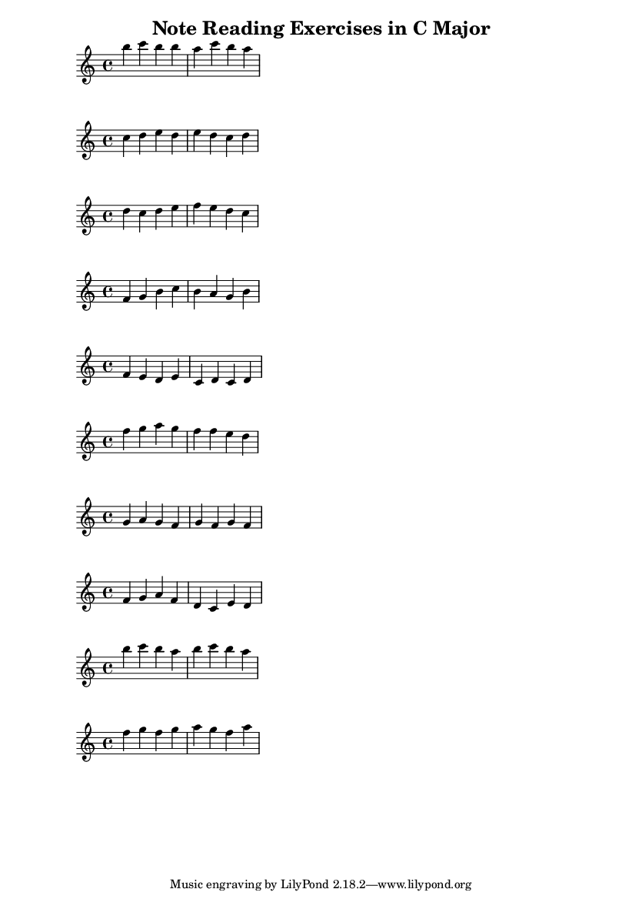

# Note Reading Exercise Generator

Melody and midi generation forked from [random-midi](https://github.com/Jobsecond/random-midi) by [Jobsecond](https://github.com/Jobsecond).

I use random-midi and [lilypond](http://lilypond.org/) (a program for typesetting sheet music in LaTeX) to generate short melodies and corresponding sheet music, intended for practising note reading for guitar.

## Prerequisites
This project is written in [Python](https://www.python.org/) 3.6.

### Generating MIDI and Sheet Music

Install [MIDIUtil](https://github.com/MarkCWirt/MIDIUtil) with `pip`:

```console
pip install MIDIUtil
```

Install [lilypond](http://lilypond.org/) with apt:

```console
sudo apt-get install lilypond
```

### Playing MIDI files

In order to play midi files you may want to install timidity:

```console
sudo apt-get install timidity timidity-interfaces-extra
```

or VLC and the appropriate plugin:


```console
sudo apt-get install vlc vlc-plugin-fluidsynth
```

## How to use?
Simply run `main.py`. A standard MIDI file will be generated in `output` folder. The filename is `{timestamp}.mid`. You'll also find a PDF file of the corresponding sheet music in `output/{timestamp}.pdf`, and the text file compiled by lilypond into this sheet music in `output/{timestamp}.txt`.

The melodies produced are very short: by default, 10 melodies of 8 notes are produced.

## Customize

There are three optional command-line arguments:

```console
python main.py --tempo <tempo> --num-exercises <# exercises> --num-bars <# bars per exercise>
```

The default tempo is slow (45). The default number of exercises (number of short melodies to be generated) is 10. The default number of bars is two, with four notes to a bar.

## Example Output

The following is sheet music generated for the sequence of melodies [found in the example MIDI file here](https://github.com/grey-area/note-reading-exercise/blob/master/examples/example.mid?raw=true). The [PDF can be found here](https://github.com/grey-area/note-reading-exercise/blob/master/examples/example.pdf?raw=true).


